# Assignment1

<br/>

## **abstract**

<br/>

写在最前，非常感谢stanford的cs348b上传的课程资源，让我能够感受到国外的优质课程，有机会锻炼和加深自己对图形学的认识。

先上一个自己的hw1笔记。

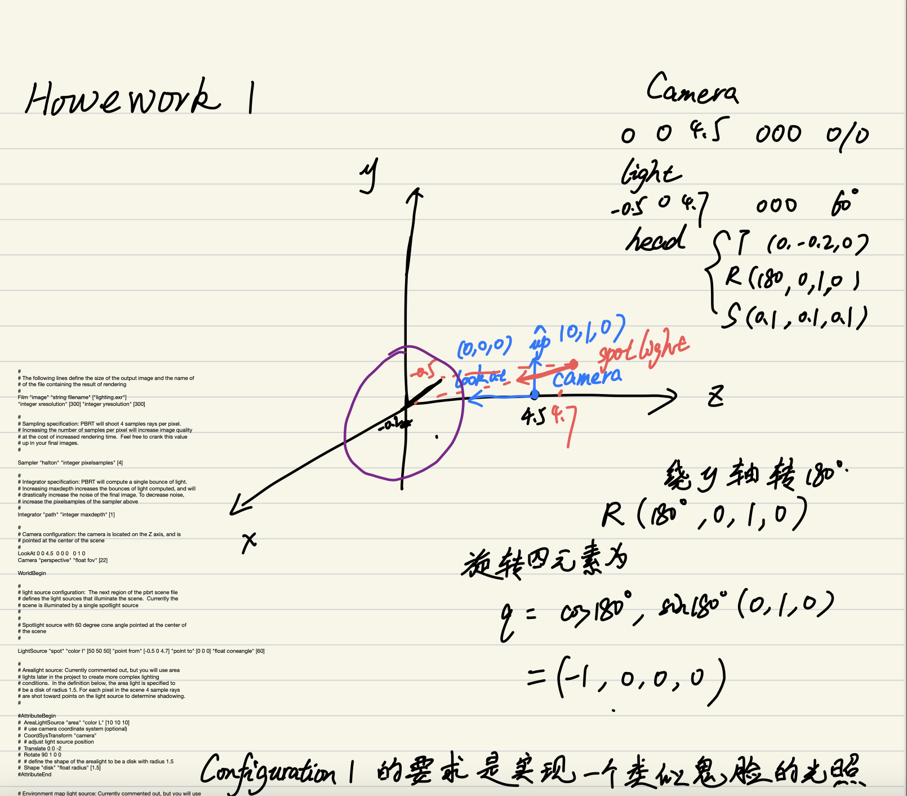

hw1感觉更像是熟悉作业（调参作业），有点像Games的作业0（俗称配环境作业），做起来比较简单，也是帮助我们认识pbr的代码范式和体系。废话不多说，直接看第一个render。

<br/>

## **render1**

<br/>

render1按它的说法是改变点光源的位置，使人物有一个自下向上的光照。它给的要求效果如下


只要调整点光源（spotlight）的位置就可以了，我们可以找到代码中关于点光源的声明和定义

```c++
LightSource "spot" "color I" [10 10 10] "point from" [-1 2 5] "point to" [0 0 0] "float coneangle" [60]
```

我们知道，spot说明它是个点光源，点光源是一个锥体，那么其中的point from和point to描述的就是锥体的高的方向，也就是中心光束的方向，float coneangle就是锥体的顶角，描述锥体的张开程度，color I描述的是光的强度和颜色，采用RGB，以上是我的理解，我们可以看一下官方给的解释。

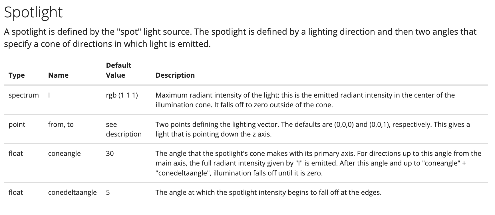

通过官方的解释，我们可以看到其实还可以调整的参数还有一个，它的名字是float conedeltaangle，含义是光线在边缘开始衰减的角度，现实中的点光源也是，它在中心位置的光线能量是相对比较多的，而在两边周围则开始衰减，这个参数还是挺合理的。但是可能是考虑到对新手友好，所以没有在示例中给出来。

首先，可以看图知道我们的光源应该在人像的前下方，也就是z坐标在人像和相机之间，y坐标为负，x为0，然后光照射的方向（这一点非常关键），看光的方向最好的方法是观察高光的位置，从上图中可以发现高光的位置应该是在下巴上，所以这就要求这个光线的仰角非常大（也就是光线要往很上面的地方看），也就是point to的y轴坐标要给的比较大，真的比较吃尝试（即便有这些基本的光照分析，还是要经过很多调试，才能调出一个大概来），下面是我的参数和效果图。

```c++
LightSource "spot" "color I" [50 50 50] "point from" [0 -4.7 4.7] "point to" [0 1000 0] "float coneangle" [60]
```

效果图如下

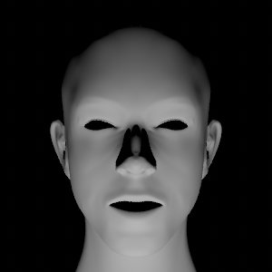

可以看到还是有差距的，主要是高光（highlight）的位置不对，我的高光可能没打到下巴上，而是打到了下巴的下方，这一点我是根据脖子的光影推断的，因为脖子上的影子在参考图中是有的，而我的没有，说明脖子在我的参数下是完全被照亮的，而在参考图中是有阴影的，这就说明我的高光位置应该偏下方了，因为只有下方的高光才能照亮脖子，但是我最终没调出一个很好的效果，作业嘛，大致能体会到出题者的精神就可以了，没必要纠结效果要和参考图一致。

另外还有值得提的一点是，渲染的采样，可以看到我的图片相对参考图来说，采样不如参考图多，其实可以考虑更改一下采样数，代码如下

```c++
Sampler "halton" "integer pixelsamples" [4] 
```

其中的integer pixelsamples的意思是每个像素采样的次数，可以调成64及以上的参数，可以得到更好的效果，但前面几个render个人认为没必要。

<br/>

## **render2**

<br/>

render2的要求是一个侧面光，而且光源被换成了disk，也就是圆盘，可以看到侧面光非常亮，直接照白了人物的半边脸，但是另外半边就是完全黑暗了。参考图如下


面光源和点光源有个最大的不同就是光源的几何形状，pbrt支持的光源形状比较有限，大致分为点光源，球光源，圆柱光源，面光源（也就是圆盘光源disk），然后就没了，下面是面光源的参数代码

```c++
AttributeBegin  
AreaLightSource "area" "color L" [10 10 10]
# use camera coordinate system [optional]  
CoordSysTransform "camera"  
# adjust light source position  
Translate 0 0 -2  
Rotate 90 1 0 0  
# define the shape of the arealight to be a disk with radius 1.5  
Shape "disk" "float radius" [1.5]  
AttributeEnd
```

首先面光源的标志是“area”，color L的参数仍旧表示光强和光的颜色，后面的CoordSysTransform "camera"的意思是使用相机的坐标系，有什么好处呢，为什么这里不继续使用之前的世界坐标系。我在pbr的书上翻到的解释如下


这段话的大意是说，制作CTM的命名副本可能是有用的，以便以后可以引用它。例如，要将光放置在相机的位置，首先将转换应用于相机坐标系是有用的，因为这样光就可以放置在原点（0，0，0）。这样，如果相机位置发生变化，场景被重新渲染，光线将随它移动。pbrtCoordinateSystem()函数将当前TransformSet复制到命名的CoordinateSystems关联数组中，pbrtCoordSysTransform()加载一组命名的CTM。最关键的是当相机位置发生变化的时候，光线的位置也会随着相机的变化而变化，这是非常重要的，因为比如我们要渲染一组类似VR的浏览图的时候，就需要这一点，如果每一张图都要我们去改变光照的位置，那会非常麻烦。

其次是Translate和Rotate，分别是平移变换和旋转变换，用于基于相机坐标系调整光照的位置，注意是基于相机坐标系！！！其余参数基本看英文就能知道意思。

了解到这些后，我们再回过头来看，这时候就要从相机坐标系的角度去思考，以相机的坐标系来调整面光源的位置，下面是我调整的参数和效果图。

```c++
AttributeBegin
  AreaLightSource "area" "color L" [200 200 200]
  # use camera coordinate system (optional)
  CoordSysTransform "camera"
  # adjust light source position
  Translate 8.5 3.55 4.25
  Rotate 90 1 0 0
  # define the shape of the arealight to be a disk with radius 1.5
  Shape "disk" "float radius" [1.5]
AttributeEnd
```

效果图如下

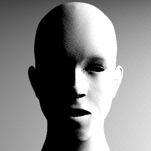

图上有很多噪声，其实可以考虑进一步提高采样数量，以此来降低噪声，但是我做的时候觉得重要的是光线的位置和强度，就没调整这个采样数量的参数。

<br/>

## **render3**

<br/>

render3的要求是双光源，介绍了fill_light的概念，也就是补偿光（或者说是辅助光源）。这个主要是摄影那边的概念，没来得及去了解，直接放效果图和参数了。

```c++
LightSource "spot" "color I" [50 50 50] "point from" [3 0 5] "point to" [0 0 0] "float coneangle" [60]

AttributeBegin
  AreaLightSource "area" "color L" [200 200 200]
  # use camera coordinate system (optional)
  CoordSysTransform "camera"
  # adjust light source position
  Translate 8.5 3.55 4.25
  Rotate 90 1 0 0
  # define the shape of the arealight to be a disk with radius 1.5
  Shape "disk" "float radius" [1.5]
AttributeEnd
```
效果图如下（加上补偿光的）

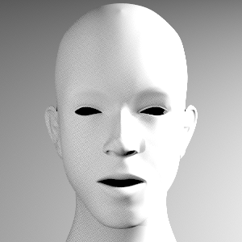

（没有补偿光的）

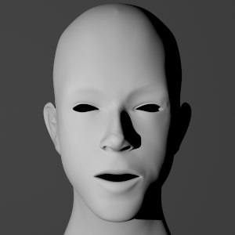

<br/>

## **render4**

<br/>

render4的要求是四个光源，而且相机的位置也被调整了，这四个光源的要求也不一样，分为main light、fill light、accent light、background light。其中的accent light个人感觉有点倾向于重点光，也就是高光了，在作业中它的说法是用于渲染这个人脸令人尴尬的头发hhh。

技术实现上其实还是调惨，分别调整就可以，作业中给出了每个光源的参考图，我们这里直接给出每个光源的参数和实现效果

```c++
# main light
 LightSource "spot" "color I" [500 500 500] "point from" [-2 9 8] "point to" [0 0 0] "float coneangle" [60]

# fill light
 LightSource "spot" "color I" [10 10 10] "point from" [-1 2 5] "point to" [0 0 0] "float coneangle" [60]

# accent light
  LightSource "spot" "color I" [10 10 10] "point from" [-1 6 -2] "point to" [0 0 0] "float coneangle" [60]

# background light
  LightSource "spot" "color I" [10 10 10] "point from" [-3 -2 -3] "point to" [10 -10 -20] "float coneangle" [60]
```

效果图如下

main_light

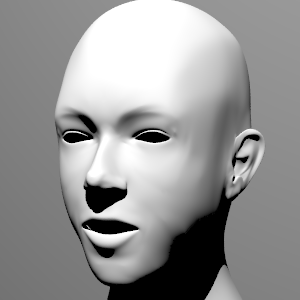

fill_light

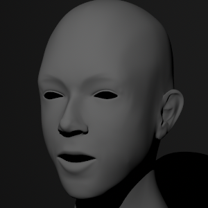

accent_light

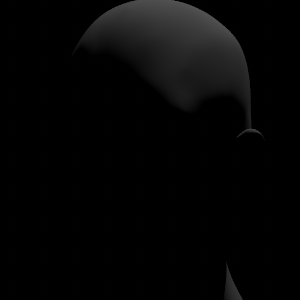

background light

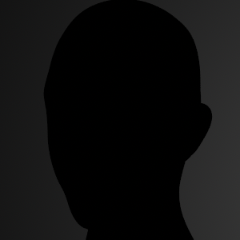

合在一起的效果图如下

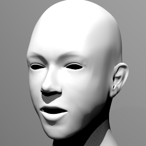

参考图如下

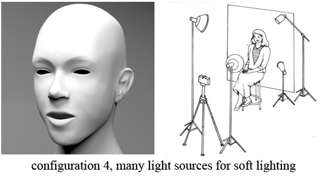

可以看到脖子那边的效果差比较多，问题应该是出在fill_light那边，fill_light的参考图如下

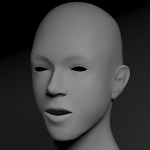

而我的fill_light是这样的


感觉我的fill_light的光源位置可能不太对，他的光源在侧面，而我的fill_light光源在正面。

<br/>

## **render5 && render6**

<br/>

这两个render主要是观赏性的，没什么调整需要做，直接放注释渲染就可以。以下是我的渲染结果。

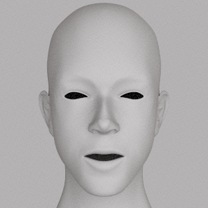

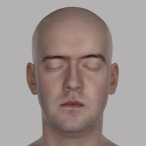

render5是说使用HDR环境光贴图，这个贴图可以非常方便地使我们不必再去一个个地调整光源的位置，render6是说模型应该有纹理和材质贴图，这样才会显得真实，直接用它提供的就可以了。

至此，作业1就算是结束了，期待下一个作业。